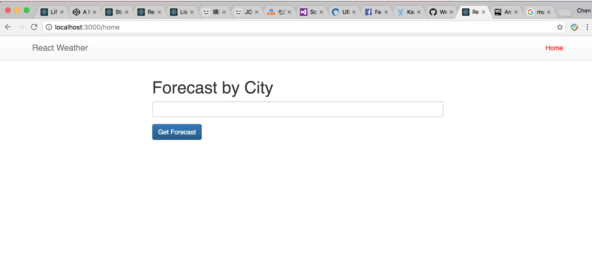
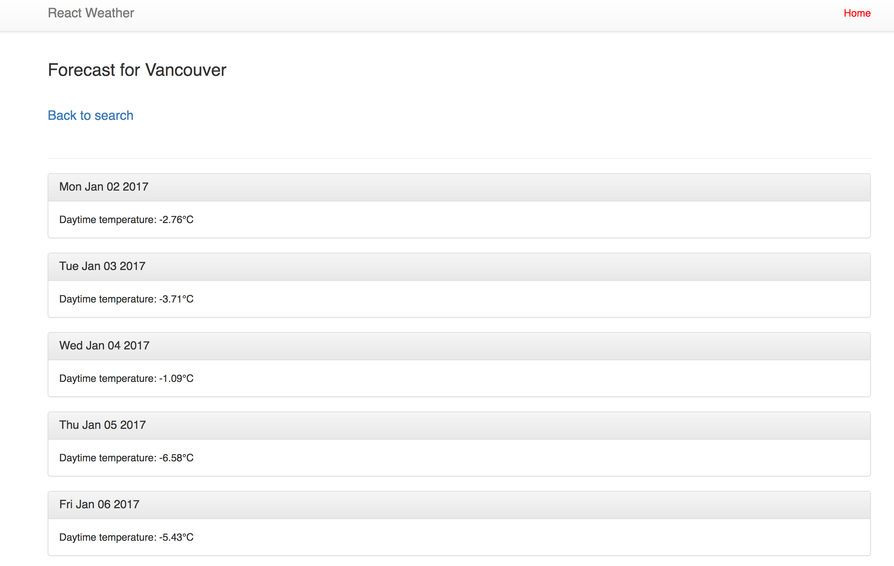

# Weather_App_React

This is an simply web-application to search a particular city weather for the next five days.

# Prerequisite
 Make sure have npm installed
 
# Set up:
 * Git clone the repository to the target folder
 * Navigate to the root directory of the project and run "npm install" to install the dependencies.

# Usage:
Open any browser and go to http://localhost:3000

Provide a city name to the search box and hit "Get Forecast", it jumps to the page which displays the daytime temputure as well as the date of the city for the next five day.

# Technologies used:
  * ReactJS
  * React-route
  * Javascript
  * Bootstrap
  * Used Weather API, http://api.openweathermap.org, to get the forecast informtion of the City
